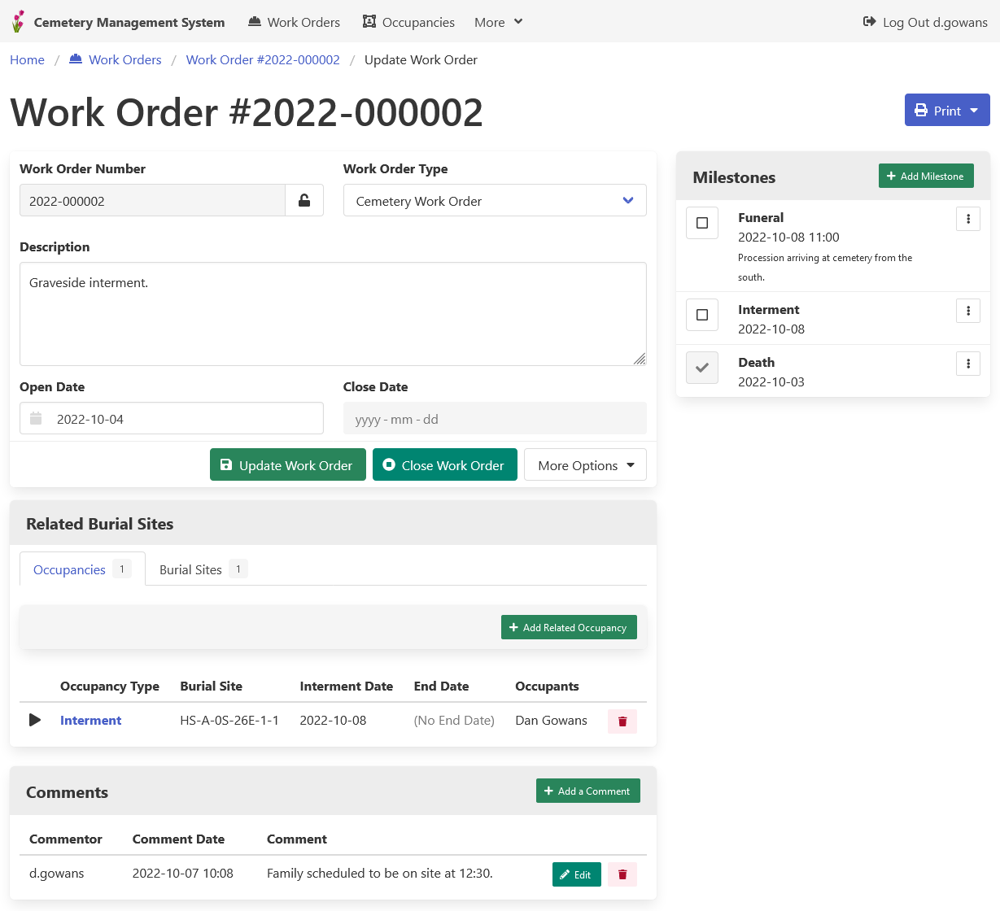
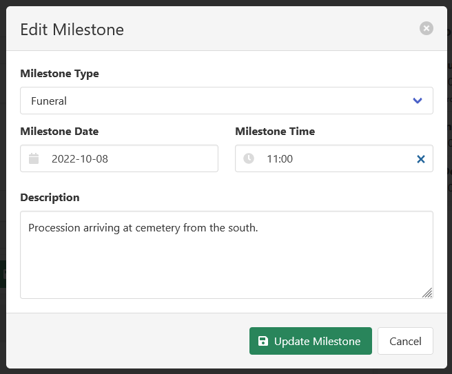

[Home](https://cityssm.github.io/lot-occupancy-system/)
•
[Help](https://cityssm.github.io/lot-occupancy-system/docs/)

# Work Orders

Work orders track tasks associated with lots and/or occupancies on lots.
There are several sections that make up each work order,
and can be used to track various details associated with the work.

## Main Details

Work orders include the following main details.

**Work Order Number** 
Note that when creating a work order, if the work order number field is left blank,
a new work order number can be generated based on the format of your choice.

**Work Order Type** 
The work order types are completely customizable and can be used to categorize work orders.

**Description** 
The work order description can describe the overall theme of the work order,
and include details that may not fit into other places on the work order.

**Open Date** 
The starting date for the work order.

**Close Date** 
The date the work order is considered complete.
Further updates to the work order are not permitted after the work order is closed.

## Related Lots and Occupancies

In order to track where the work is taking place and who is affected by the work,
work orders can be linked to lots (burial sites in the example above)
and occupancies.

## Comments

Comments offer open logging that can track various details that arise throughout the work order.

## Milestones

Work orders can be broken up into actionable items, called milestones.
Milestone types are completely customizable and can be used to categorize milestones.
The date, and optional time, track when the milestone is scheduled to be completed.

Milestones appear on the main application dashboard,
and can be linked to calendar applications like Microsoft Outlook.